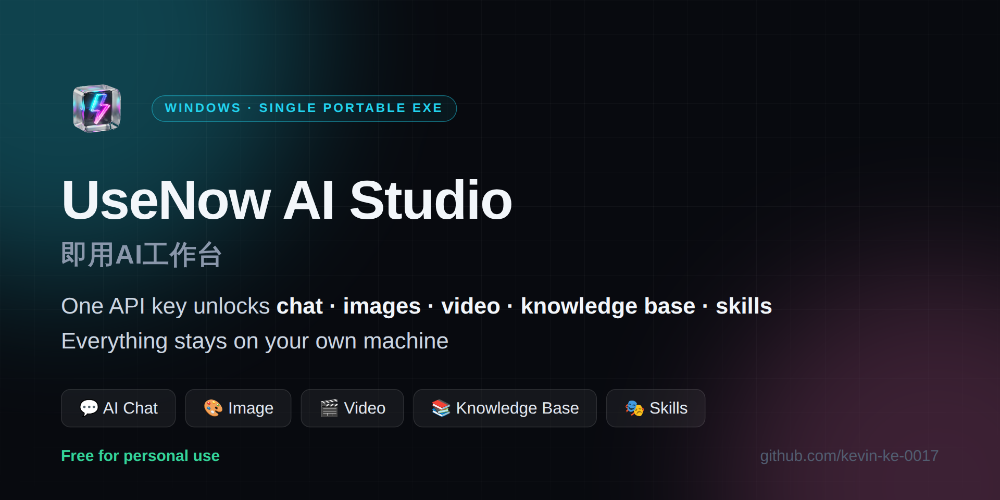
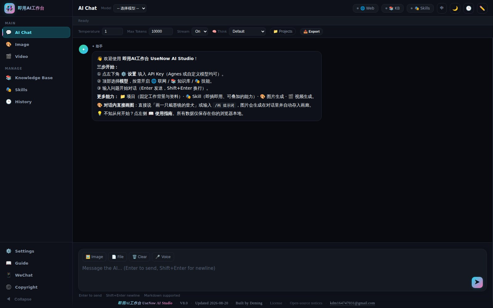
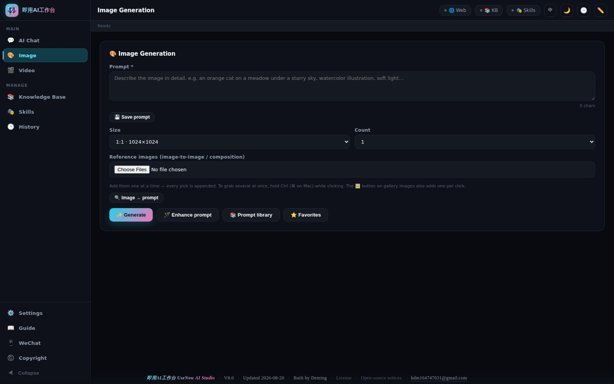
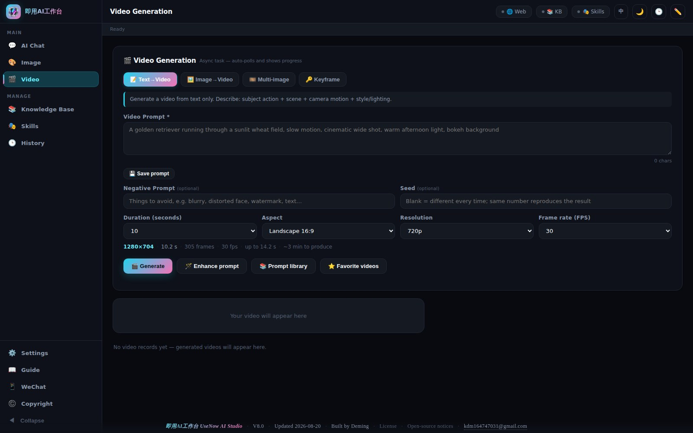
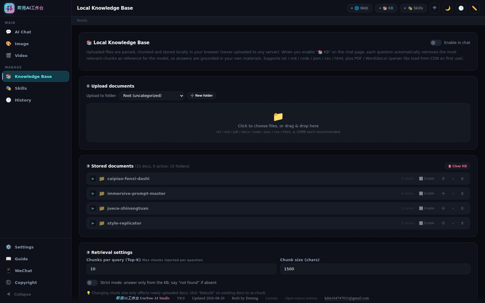
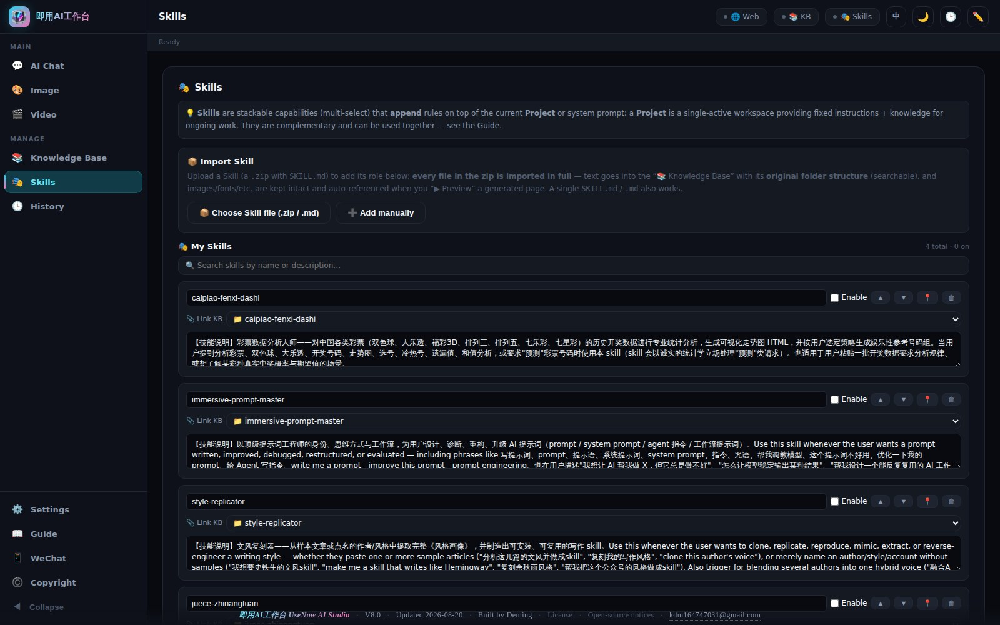
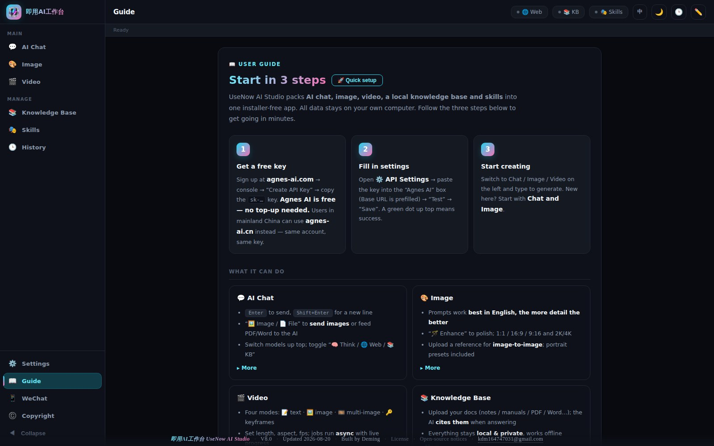

<p align="right"><a href="README.md">🇨🇳 简体中文</a> · <b>🇬🇧 English</b></p>

<p align="center">
  
</p>

<h1 align="center">UseNow AI Studio</h1>

<p align="center">
  <b>AI chat, image generation, video generation, a local knowledge base and skills — in one installer-free Windows app.</b><br>
  Double-click to run · Your data never leaves your machine · No account, no login, no upload
</p>

<p align="center">
  
  
  
  
  
</p>

<p align="center">
  <a href="../../releases/latest"><b>⬇️ Download the latest release</b></a> ·
  <a href="#-get-started-in-3-steps">Get started</a> ·
  <a href="#-faq">FAQ</a> ·
  <a href="COMMERCIAL.en.md">Commercial licensing</a> ·
  <a href="#-support-the-project">Support</a>
</p>

---

## What is this

Most AI tools want a monthly subscription, scatter features across a dozen websites, and upload your documents to someone else's servers.

**UseNow AI Studio** puts all of it into a single portable Windows executable: **paste one API key and every feature works immediately.**
Chats, images and knowledge-base documents all live on your own computer. The app has **no account system, collects no data and uploads nothing** — it talks only to the AI provider you configure yourself.

> 💡 Built for people who want to get real work done with AI, without setting up a dev environment, and without handing their documents to a cloud service.

---

## 📸 Screenshots

<table>
<tr>
<td width="50%"><p align="center"><b>💬 AI Chat</b><br><sub>Switch models · see thinking · compare answer versions</sub></p></td>
<td width="50%"><p align="center"><b>🎨 Image generation</b><br><sub>Prompt library · image-to-image · AI prompt polish</sub></p></td>
</tr>
<tr>
<td width="50%"><p align="center"><b>🎬 Video generation</b><br><sub>Text-to-video · image-to-video · multi-image · keyframes</sub></p></td>
<td width="50%"><p align="center"><b>📚 Local knowledge base</b><br><sub>PDF / Word / Markdown, searched entirely on-device</sub></p></td>
</tr>
<tr>
<td width="50%"><p align="center"><b>🎭 Skills</b><br><sub>Import a skill pack, switch expert roles instantly</sub></p></td>
<td width="50%"><p align="center"><b>📖 Built-in guide</b><br><sub>Three steps to your first result — no docs needed</sub></p></td>
</tr>
</table>

---

## ✨ Features

| Feature | What you get |
| --- | --- |
| 💬 **AI Chat** | Switch models in one click; send images for vision; feed PDF/Word and let the AI read them; toggle thinking, web search and knowledge-base citation; **regenerating keeps the previous answer so you can compare**; export a whole conversation to HTML / PDF / long image |
| 🎨 **Image generation** | Built-in prompt library (including several portrait presets); image-to-image; one-click AI prompt polish; 1:1 / 16:9 / 9:16 at 2K / 4K |
| 🎬 **Video generation** | Text-to-video, image-to-video, multi-image and keyframe modes; set duration / aspect / frame rate; async generation with live progress |
| 📚 **Local knowledge base** | Import notes, manuals, PDF, Word; answers cite the source passages; **nothing ever leaves your machine** |
| 🎭 **Skills** | Import skill packs (Claude Skill `.zip` format supported) to turn the AI into a domain expert; searchable, toggle on demand |
| 🗂️ **Projects & history** | Group conversations by project, favorite them, search them, reopen them anytime |
| 💾 **Backup & restore** | Export everything to a single backup file; restore it on a new machine in one click |
| 🌏 **Bilingual UI** | Switch between English and 简体中文 in one click |

---

## 🚀 Get started in 3 steps

### 1️⃣ Download

Grab `UseNowAIStudio-x.y.z-win64.zip` from the **[Releases page](../../releases/latest)**, unzip it, and double-click `UseNowAIStudio-x.y.z-portable.exe` inside.

The zip holds just three things: the app, a bilingual quick-start text file, and a SHA256 checksum file.

**No installer.** Double-click and it runs — no registry writes, no drivers, no admin rights. To uninstall, delete the file.

### 2️⃣ Get an API key

The app ships **no AI capacity of its own** — you bring your own provider key (the same way a browser ships no websites).

Pick any provider: Agnes AI, DeepSeek, OpenAI, Gemini, Claude, Qwen, Zhipu GLM… **⚙️ API Settings → Quick add** already has the endpoints and popular models preconfigured. Choose one, paste the key, done.

> New to this? Start with a provider that offers free credits, then decide where to spend money.

### 3️⃣ Create

Open the app → ⚙️ Settings (bottom left) → paste your key → hit "Test" until the dot turns green → Save. Then pick Chat / Image / Video on the left and start.

There's a **📖 Guide** page inside the app with three-step setup and practical tips for every feature.

---

## ❓ FAQ

<details>
<summary><b>My antivirus / Windows warns about an "unknown publisher"</b></summary>

That's the standard experience for software from an independent developer without a paid code-signing certificate. It is **not malware**.

Downloading the zip and extracting it usually opens without any prompt. If your extraction tool carries the Mark of the Web over to the exe, Windows SmartScreen will flag it — unsigned software with a low download count always gets flagged. Either click **"More info" → "Run anyway"**, or right-click the exe → **Properties** → tick **"Unblock"**, which silences it permanently.

Want to verify the file yourself? Every release ships a **SHA256 checksum**. In PowerShell:

```powershell
Get-FileHash .\UseNowAIStudio-6.4.0-win64.zip -Algorithm SHA256
Get-FileHash .\UseNowAIStudio-6.4.0-portable.exe -Algorithm SHA256
```

If it matches the value in the release notes, the file is untampered.
</details>

<details>
<summary><b>Where is my data stored? Is anything uploaded?</b></summary>

**Nothing is uploaded. There is no account system and no analytics, telemetry or crash reporting of any kind.**

Everything lives in `%APPDATA%\UseNowAIStudio` on your machine: settings, chats and skills in localStorage; generated images and knowledge-base documents in IndexedDB.

The app only sends requests to **the AI provider you configured yourself** — which is the one network call using AI necessarily requires. Nothing else. See [PRIVACY.en.md](PRIVACY.en.md).

⚠️ One caveat: generated **videos** are stored as the provider's temporary URL, which expires. **Download the ones you want to keep.**
</details>

<details>
<summary><b>Does it cost anything?</b></summary>

**The app is free for personal use** — no trial period, no crippled features, no ads.

What costs money is **your own API usage**, paid directly to your AI provider. I take no cut. It also means you **pay only for what you use**, which is usually far cheaper than a monthly subscription.
</details>

<details>
<summary><b>Mac / Linux / mobile?</b></summary>

Only **Windows 10/11 64-bit** is published today. Other platforms depend on demand — [open an issue](../../issues) and tell me what you need.
</details>

<details>
<summary><b>Why isn't it open source?</b></summary>

This is a commercial product I built on my own time. It is **free to use, but not open source**.

You may download it, use it for free, and use it to make money with your own work. You may not resell it, redistribute it, or reverse-engineer it. Full terms in the [LICENSE](LICENSE).
</details>

<details>
<summary><b>Will I lose data when I change computers?</b></summary>

Yes — everything is local, so **back up first**: ⚙️ Settings → "Backup & Restore" → "📤 Export all data" produces one file containing everything. On the new machine, "📥 Import & restore" brings it all back.
</details>

---

## 🔒 Privacy

- ❌ No account, no login, no cloud sync
- ❌ No analytics, no telemetry, no crash reporting
- ✅ 100% of your data stays local and can be exported at any time
- ✅ Talks only to the AI provider you configure

Full statement: **[PRIVACY.en.md](PRIVACY.en.md)**.

---

## 📄 Licensing

| Use case | Cost |
| --- | --- |
| **Personal use** (including freelance work you get paid for) | ✅ **Free forever** |
| **Company / team internal use** | Commercial license required |
| **Custom builds / white-label / on-premise** | Custom engagement |
| **Reselling, redistribution, reverse engineering** | ❌ Not permitted |

Commercial licensing, custom development and brand partnerships → **[COMMERCIAL.en.md](COMMERCIAL.en.md)**, or email **kdm164747031@gmail.com**.

This is proprietary software. © Deming. All rights reserved. Full terms in the [LICENSE](LICENSE) (EULA); bundled open-source components are listed in [THIRD-PARTY-NOTICES.txt](THIRD-PARTY-NOTICES.txt).

---

## ☕ Support the project

I build this alone and give it away for free. If it saved you time or a subscription fee, a coffee is very welcome — **entirely optional, every feature works either way**.

<p align="center">
  <a href="https://ko-fi.com/eldenkeebler"></a>
</p>

Free ways to help, which matter just as much:

- ⭐ **Star this repo** — it's the single biggest thing you can do for visibility
- 🗣️ Tell someone who'd find it useful
- 🐛 [Open an issue](../../issues) with a bug report or feature idea

---

## 💼 Business enquiries

- 🏢 **Commercial licensing** — compliant use inside a company or team
- 🛠️ **Custom development** — bespoke features, white-labelling, on-premise deployment against your own models
- 📢 **Sponsorship / brand placement** — inside the app or on this page

📧 **kdm164747031@gmail.com** — please state your company and what you need; I reply as soon as I can.

---

## 📜 Changelog

See **[CHANGELOG.en.md](CHANGELOG.en.md)**.

---

## ⚠️ Disclaimer

This software is provided "AS IS", with no warranty as to the accuracy, legality or fitness of any AI-generated content. AI output is for reference only — verify before you rely on it. You are responsible for complying with your local laws and with the terms of the AI providers you use. Any consequence arising from use of this software is yours to bear.

---

<p align="center">
  <sub>Built by Deming (德铭) · kdm164747031@gmail.com<br>
  © 2026 Deming. All Rights Reserved.</sub>
</p>
