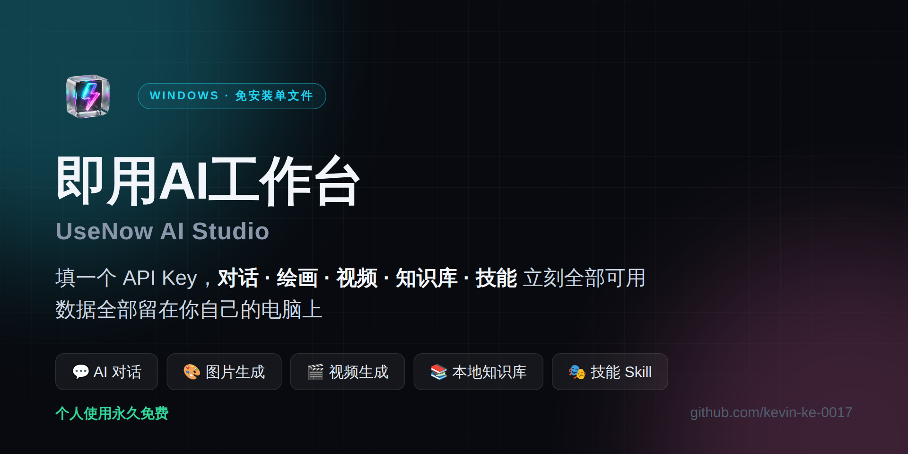
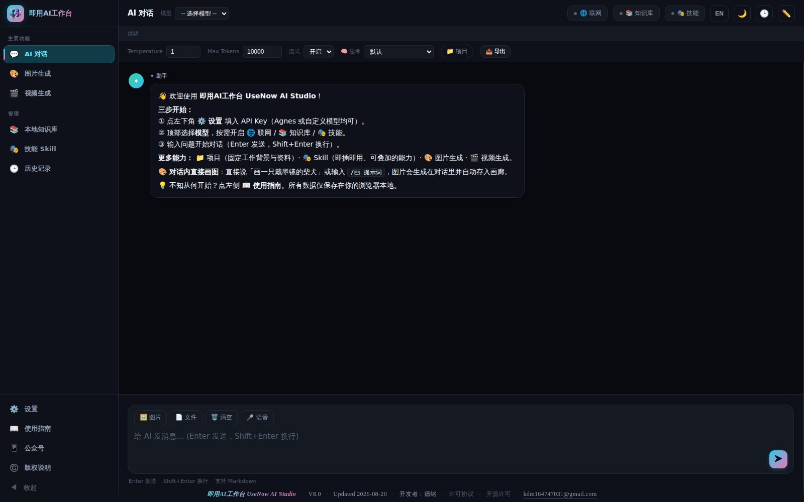
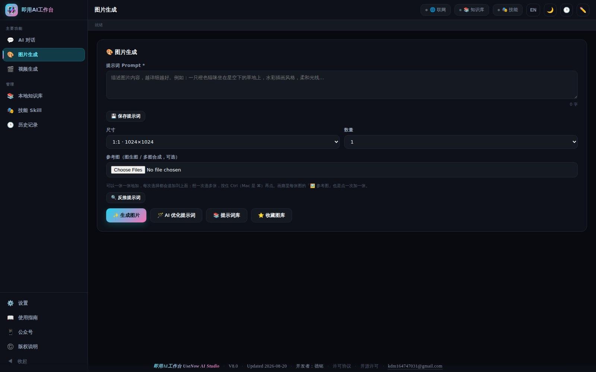
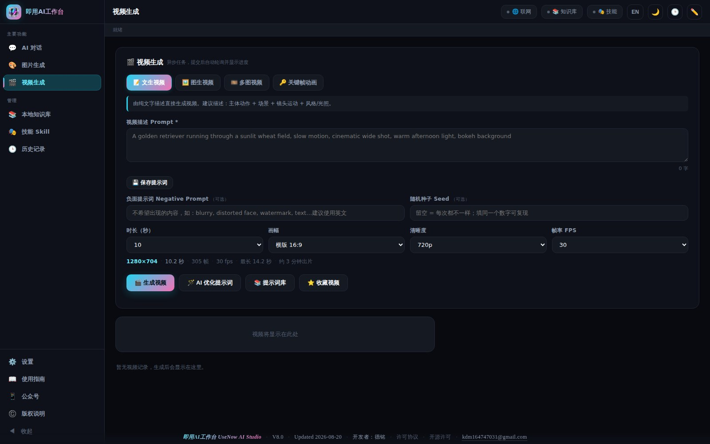
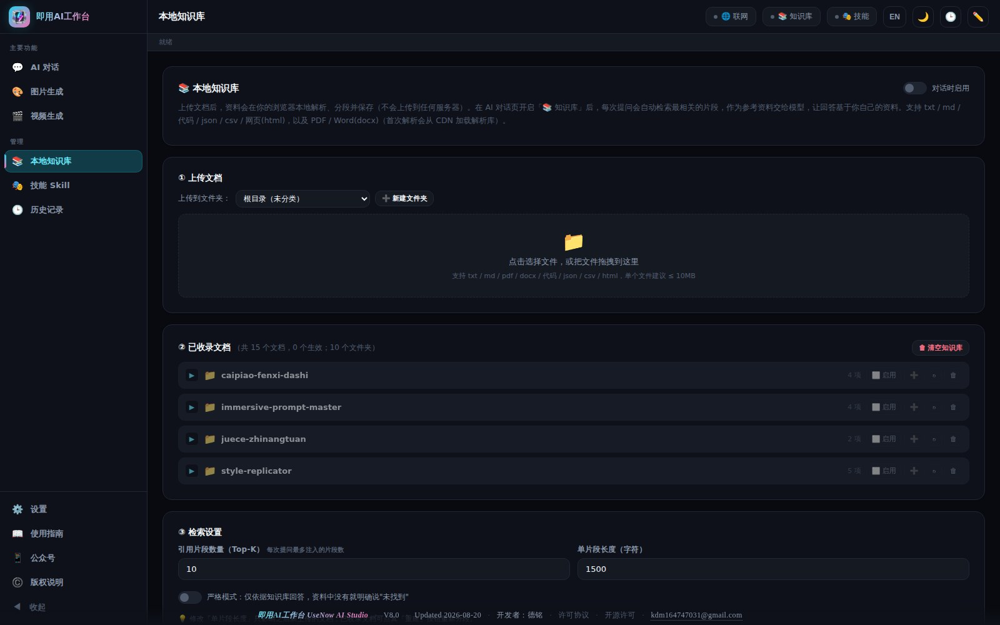
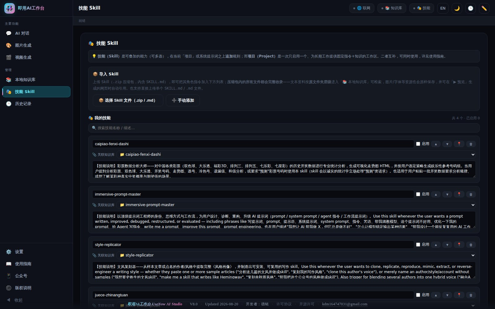
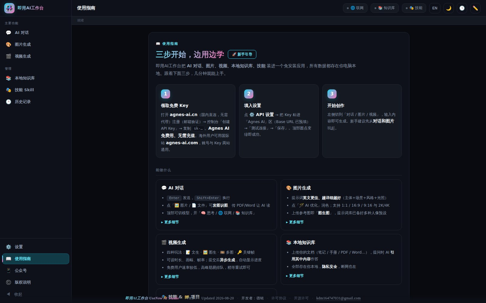
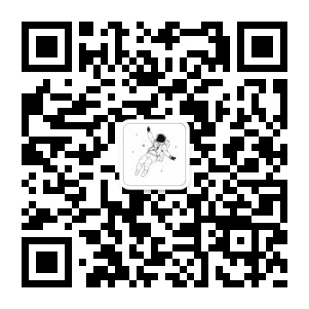

<p align="right"><b>🇨🇳 简体中文</b> · <a href="README.en.md">🇬🇧 English</a></p>

<p align="center">
  
</p>

<h1 align="center">即用AI工作台 · UseNow AI Studio</h1>

<p align="center">
  <b>把 AI 对话、AI 绘画、AI 视频、本地知识库、技能库，装进一个免安装的 Windows 单文件。</b><br>
  双击就能用 · 数据全部留在你自己电脑上 · 不注册、不登录、不上传
</p>

<p align="center">
  
  
  
  
  
  
</p>

<p align="center">
  <a href="../../releases/latest"><b>⬇️ 下载最新版</b></a> ·
  <a href="#-三步开始">三步开始</a> ·
  <a href="#-常见问题">常见问题</a> ·
  <a href="COMMERCIAL.md">商用授权与定制</a> ·
  <a href="#-支持作者">支持作者</a>
</p>

---

## 这是什么

市面上的 AI 工具，要么按月订阅、要么功能分散在十几个网站、要么把你的资料传到别人的服务器上。

**即用AI工作台**把这些揉进了一个 Windows 免安装 exe：**填一个 API Key，全部功能立刻可用**。
所有对话、图片、知识库文档都存在你自己的电脑里，软件本身**不设账号、不收集任何数据、不上传任何内容**——它只和你自己填的那个 AI 服务商通信。

> 💡 面向的是：想认真用 AI 干活、但不想折腾环境、也不放心把资料传上云的人。

---

## 📱 安卓版已发布（V7.8）

手机上跑的是**同一份程序**——不是精简版，也不是配套 App。界面、数据格式、API 设置与电脑版完全一致，同一个 API Key 直接填进去就能用：对话、AI 绘画、AI 视频、本地知识库、技能库，一样不少。

| | |
|---|---|
| 系统要求 | Android 6.0 及以上，手机 / 平板均可 |
| 安装方式 | 直接安装 APK，**不需要应用商店、不需要 root** |
| 数据存放 | 和电脑版一样，全部留在你自己的手机里 |
| 与电脑版的差异 | 只有一处：**语音输入与朗读在手机端不提供**（安卓系统 WebView 不支持这两项能力），其余功能一致 |

针对手机做了实机打磨：图片和视频**一键存进系统相册**、返回键逐级关闭面板而不是直接退出程序、顶栏与弹窗自动让开状态栏和手势条、按钮尺寸按触控标准放大。

> **本仓库不提供 APK 下载。** 安卓版不通过公开 Release 分发。需要的话请通过
> [提 Issue](../../issues) 或邮件 **kdm164747031@gmail.com** 联系。
>
> 另外两件事先说清楚：**鸿蒙 NEXT 不兼容安卓 APK，装不上**；**iOS 暂不支持**。

---

## 📸 界面预览

<table>
<tr>
<td width="50%"><p align="center"><b>💬 AI 对话</b><br><sub>多模型切换 · 思考过程 · 答案版本对比</sub></p></td>
<td width="50%"><p align="center"><b>🎨 图片生成</b><br><sub>提示词库 · 图生图 · AI 优化提示词</sub></p></td>
</tr>
<tr>
<td width="50%"><p align="center"><b>🎬 视频生成</b><br><sub>文生视频 · 图生视频 · 多图 / 关键帧</sub></p></td>
<td width="50%"><p align="center"><b>📚 本地知识库</b><br><sub>PDF / Word / Markdown 全在本机检索</sub></p></td>
</tr>
<tr>
<td width="50%"><p align="center"><b>🎭 技能 Skill</b><br><sub>导入技能包，一键切换专家角色</sub></p></td>
<td width="50%"><p align="center"><b>📖 内置使用指南</b><br><sub>小白也能三步上手，不用看文档</sub></p></td>
</tr>
</table>

---

## ✨ 能做什么

| 功能 | 说明 |
| --- | --- |
| 💬 **AI 对话** | 多模型一键切换；发图让 AI 识图；传 PDF / Word 让 AI 读；可开思考过程、联网搜索、知识库引用；**重新生成会保留旧答案供对比**；整段对话可导出 HTML / PDF / 长图 |
| 🎨 **图片生成** | 内置提示词库（含多套人像大片预设）；支持图生图；一键 AI 优化提示词；1:1 / 16:9 / 9:16 与 2K / 4K |
| 🎬 **视频生成** | 文生视频、图生视频、多图、关键帧四种玩法；可设时长 / 画幅 / 帧率；异步生成带进度 |
| 📚 **本地知识库** | 导入笔记、手册、PDF、Word；提问时自动检索并引用原文；**全程不出本机** |
| 🎭 **技能 Skill** | 导入技能包（支持 Claude Skill 格式的 .zip），把 AI 变成特定领域的专家；支持搜索、快捷启用 |
| 🗂️ **项目 / 历史** | 对话按项目分组、可收藏、可搜索；历史记录随时找回 |
| 💾 **数据备份** | 一键把全部数据导出成单个备份文件，换机 / 重装一键还原 |
| 🌏 **中英双语** | 界面一键切换中文 / English |

---

## 🚀 三步开始

### 1️⃣ 下载

到 **[Releases 页面](../../releases/latest)** 下载 `UseNowAIStudio-x.y.z-win64.zip`，解压后双击里面的 `UseNowAIStudio-x.y.z-portable.exe`。

压缩包里只有三样东西：主程序、一份中英文使用说明、一个 SHA256 校验值文件。

**免安装**——解压完双击就能运行，不写注册表、不装驱动、不需要管理员权限。想卸载？删掉这个 exe 就行。

### 2️⃣ 拿一个 API Key

软件本身**不含 AI 算力**，需要你自己的 AI 服务商 Key（就像浏览器不含网站内容一样）。

任选一家：Agnes AI、DeepSeek、OpenAI、Gemini、Claude、通义千问、智谱 GLM……软件内的「⚙️ API 设置 → 快捷添加」已经预置好了这些服务商的地址和常用模型，选一个、粘贴 Key 即可。

> 新手建议先用**有免费额度**的服务商试水，跑通了再决定充值哪家。

### 3️⃣ 开始用

打开软件 → 左下角 ⚙️ 设置 → 粘贴 Key → 「测试连接」变绿 → 保存。左侧切到「对话 / 图片 / 视频」开始创作。

软件内有 **📖 使用指南**页，三步图解 + 每个功能的实用技巧，不用看这个 README 也能上手。

---

## ❓ 常见问题

<details>
<summary><b>杀毒软件 / Windows 报「未知发布者」怎么办？</b></summary>

这是**未购买代码签名证书的独立开发者软件的通病**，不是病毒。

正常情况下，从 Releases 下载 zip、解压后双击是不会弹提示的。如果你的解压工具把「网络来源标记」一并带了过来，Windows SmartScreen 就会弹「Windows 已保护你的电脑」——两种处理方式，任选其一：

- 点 **「更多信息」→「仍要运行」**
- 或右键 exe →「属性」→ 勾选底部的 **「解除锁定」** → 确定，之后就再也不会弹

部分国产杀软也可能误报 Electron 打包程序，加信任即可。

想自己确认文件没被篡改？每个 Release 都附了 **SHA256 校验值**（zip 和 exe 各一个），在 PowerShell 里运行：

```powershell
Get-FileHash .\UseNowAIStudio-6.4.0-win64.zip -Algorithm SHA256
Get-FileHash .\UseNowAIStudio-6.4.0-portable.exe -Algorithm SHA256
```

和 Release 页 `SHA256.txt` 里的值对得上就是原版。
</details>

<details>
<summary><b>我的数据存在哪？会不会被上传？</b></summary>

**不会。软件没有账号系统，也没有任何统计 / 埋点 / 回传代码。**

所有数据存在你本机的 `%APPDATA%\UseNowAIStudio`：对话、配置、技能在 localStorage，图片实体和知识库文档在 IndexedDB。

软件只会向**你自己在设置里填的那个 AI 服务商地址**发请求（那是你主动选择的、要用 AI 就必须发生的通信）。除此之外不连任何服务器。详见 [隐私说明](PRIVACY.md)。

⚠️ 唯一要注意的：生成的**视频**存的是服务商的临时在线地址，会过期，**想永久保留请及时下载到本地**。
</details>

<details>
<summary><b>要花钱吗？</b></summary>

**软件本身对个人用户免费**，无试用期、无功能阉割、无弹窗广告。

花钱的部分是你自己的 **AI API 用量**——这笔钱你直接付给 AI 服务商，与本软件无关，我也拿不到任何分成。这也意味着：**用多少花多少**，通常比按月订阅便宜得多。
</details>

<details>
<summary><b>支持 Mac / Linux / 手机吗？</b></summary>

**手机：安卓版已经有了**（Android 6.0+），和电脑版是同一份程序，详见上面的[安卓版一节](#-安卓版已发布v78)。APK 不在本仓库分发，需要请联系我。

**iOS 暂不支持**，短期内也不会有——不上架应用商店的话只能靠开发者证书侧载，证书过期后 App 会直接闪退，不适合交给普通用户。

**Mac / Linux** 视需求再定——[提个 Issue](../../issues) 告诉我你想要哪个平台。
</details>

<details>
<summary><b>为什么不开源？</b></summary>

这是我个人投入大量时间做的商业产品，**免费给个人用户使用，但不开放源码**。

你可以免费下载、免费用、随便用它干活赚钱；但不能转卖、二次分发或逆向。完整条款见 [许可协议](LICENSE)。
</details>

<details>
<summary><b>换电脑 / 重装系统会丢数据吗？</b></summary>

会 —— 数据都在本机。**换机前请务必先备份**：⚙️ 设置 →「数据备份与恢复」→「📤 导出全部数据」，会生成一个包含全部数据的备份文件；新电脑上用「📥 导入并恢复」即可完整还原。
</details>

---

## 🔒 隐私

- ❌ 无账号、无登录、无云端同步
- ❌ 无统计、无埋点、无遥测、无崩溃上报
- ✅ 数据 100% 存于本机，随时可一键导出带走
- ✅ 只和你自己配置的 AI 服务商通信

完整说明见 **[PRIVACY.md](PRIVACY.md)**。

---

## 📄 授权说明

| 用途 | 是否需要付费 |
| --- | --- |
| **个人使用**（含用它接活赚钱） | ✅ **永久免费** |
| **企业 / 团队内部使用** | 需要商用授权 |
| **定制开发 / 换品牌 / 私有化部署** | 定制服务 |
| **转卖、二次分发、逆向** | ❌ 不允许 |

商用授权、定制开发、品牌合作 → 见 **[COMMERCIAL.md](COMMERCIAL.md)**，或直接邮件 **kdm164747031@gmail.com**。

本软件为专有软件，版权归开发者德铭（Deming）所有，保留一切权利。
完整条款见 [LICENSE](LICENSE)（EULA）；内含的第三方开源组件声明见 [THIRD-PARTY-NOTICES.txt](THIRD-PARTY-NOTICES.txt)。

---

## ☕ 支持作者

这个软件是我一个人做的，免费给大家用。如果它帮你省了时间或省了订阅费，欢迎请我喝杯咖啡——**完全自愿，不打赏也一样能用全部功能**。

<p align="center">
  <a href="https://ko-fi.com/eldenkeebler"></a>
</p>

<p align="center"><sub>支持信用卡 / PayPal ·（国内打赏渠道后续再开）</sub></p>

也欢迎用这些**零成本**的方式支持我：

- ⭐ 给这个仓库点个 **Star**（对我很重要，能让更多人看到）
- 🗣️ 推荐给你觉得用得上的朋友
- 🐛 [提 Issue](../../issues) 反馈 bug 或提功能建议
- 📱 关注公众号「**AI创收公社**」，获取更新提醒与 AI 干货教程

<p align="center">
  <br>
  <sub>扫码关注公众号「AI创收公社」</sub>
</p>

---

## 💼 商务合作

有以下需求欢迎直接联系：

- 🏢 **企业商用授权** —— 团队 / 公司内部合规使用
- 🛠️ **定制开发** —— 按你的业务定制功能、换品牌换 logo、内网私有化部署
- 📢 **品牌合作 / 广告位** —— 在软件内或本页留展示位

📧 **kdm164747031@gmail.com**（邮件请注明来意，我会尽快回复）

---

## 📜 更新日志

见 **[CHANGELOG.md](CHANGELOG.md)**。

---

## ⚠️ 免责声明

本软件按「现状」提供，不对 AI 生成内容的准确性、合法性、可用性作任何保证。AI 生成内容仅供参考，请自行判断后使用。使用者须遵守所在地法律法规及所用 AI 服务商的服务条款。因使用本软件产生的任何后果由使用者自行承担。

---

<p align="center">
  <sub>开发者：德铭（Deming） · kdm164747031@gmail.com<br>
  © 2026 Deming. All Rights Reserved.</sub>
</p>
